# DictateCLI

> Speak to Claude Code instead of typing.

DictateCLI adds a microphone button to Claude Code, using Claude Code's own native
voice dictation.



**Click. Speak. Send.**

Windows 10/11 · Claude Code native voice · No extra API key · MIT

## Install

```powershell
git clone https://github.com/augbastos/dictate-cli
cd dictate-cli
pwsh -File scripts\install.ps1
```

Then open Claude Code as usual. A 🎙 button appears above the prompt.

You need Claude Code signed in with a Claude.ai account, a microphone, and
[PowerShell 7](https://learn.microsoft.com/powershell/scripting/install/installing-powershell-on-windows)
(`winget install Microsoft.PowerShell`).

## Use

| | Mouse | Keyboard |
|---|---|---|
| Start | click 🎙 | Alt+D |
| Send | click **Send** | Alt+D |
| Cancel | click **Cancel** | Esc |

Your words show up in the prompt while you speak. Cancel sends nothing. Text you had
already typed is kept and comes back after you send.

## Language

DictateCLI uses Claude Code's voice language. To dictate in another language, set
Claude Code's `language` setting (for example `"language": "portuguese"` in
`~/.claude/settings.json`). It also changes the language Claude answers in.

## Privacy

DictateCLI does not record, store or send audio, uses no other speech service, and
adds no telemetry. Claude Code's built-in voice dictation does the recording and the
transcription, through Anthropic.

## Limitations

- Windows only for now. macOS and Linux are not supported in this release.
- Clicks need Claude Code's fullscreen mode (the installer turns it on).
- Voice works where Claude Code runs locally, not over SSH or in cloud sessions.

## Uninstall

```powershell
pwsh -File scripts\uninstall.ps1
```

This restores the settings DictateCLI changed.

## Learn more

[How it works](docs/architecture.md) · [Compatibility](docs/compatibility.md) ·
[Security](SECURITY.md) · [Changelog](CHANGELOG.md)
