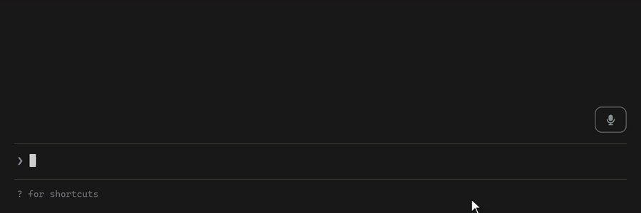

# DictateCLI

> Speak to Claude Code instead of typing.

DictateCLI adds a microphone button to Claude Code, using Claude Code's own native
voice dictation.


<sub>Simulated animation of the flow, not a screen recording.</sub>

**Click. Speak. Send.**

Windows · Claude native voice · No extra API key · MIT

## Install

```powershell
git clone https://github.com/augbastos/dictate-cli
cd dictate-cli
pwsh -File scripts\install.ps1
```

Restart Claude Code. The microphone appears above the prompt.

Installed the plugin another way, for example with `/plugin`? Run `/dictate setup` once
instead, then restart Claude Code; run it again after each plugin update.
`/dictate remove` undoes it.

Requires Claude Code (2.1.287+) with voice dictation, a microphone and
[PowerShell 7](https://learn.microsoft.com/powershell/scripting/install/installing-powershell-on-windows).
The installer checks these first and changes nothing if one is missing.
`pwsh -File scripts\doctor.ps1` tells you if anything is off.

## Use

| Action | What it does |
|---|---|
| Click 🎙 | Start dictating |
| **Send** | Transcribe and send |
| **Cancel** / Esc | Discard the recording |
| Alt+D | Start / send from the keyboard |

Anything you were typing before dictation stays safe and comes back afterward.

## Why DictateCLI?

Claude Code already has voice dictation. DictateCLI does not replace it; it gives it
a simple microphone button.

- No extra speech service
- No extra API key
- No audio stored by DictateCLI
- No background process while idle

## Language

DictateCLI follows Claude Code's voice language setting. Change it in `/config` if
needed.

## Privacy

DictateCLI itself records nothing, stores nothing, opens no network connection and adds
no telemetry. Your voice is captured and transcribed by Claude Code's built-in voice
dictation, which sends the audio to Anthropic. Details: [PRIVACY.md](PRIVACY.md).

## Compatibility

Tested on **Windows 11 x64**, with Claude Code in the VS Code integrated terminal.
Windows 10 x64 is expected to work but not yet tested.
Other terminals, such as Windows Terminal, are not yet tested.

macOS and Linux are not supported in this release. Details:
[docs/compatibility.md](docs/compatibility.md)

<details>
<summary><strong>Troubleshooting</strong></summary>

- **The mic button does not react.** Clicks need Claude Code's fullscreen mode. The
  installer turns it on; restart Claude Code.
- **Nothing is heard.** Allow the microphone in Windows Settings → Privacy & security
  → Microphone, and check that Claude Code's own `/voice` works.
- **Wrong language.** Set Claude Code's language in `/config`.
- **Alt+D does nothing.** Run the installer again, then restart Claude Code.
- **"Could not reach Claude Code voice."** Run the installer again.
- **Anything else.** Run `pwsh -File scripts\doctor.ps1`; it names what is wrong and
  how to fix it.

</details>

## Uninstall

```powershell
pwsh -File scripts\uninstall.ps1
```

## How it works

DictateCLI is a small Claude Code plugin that adds the microphone button and
controls Claude Code's existing voice dictation. It has no speech engine of its own.
See [docs/architecture.md](docs/architecture.md).

## License

MIT. DictateCLI is an independent community plugin, not made or endorsed by Anthropic.
